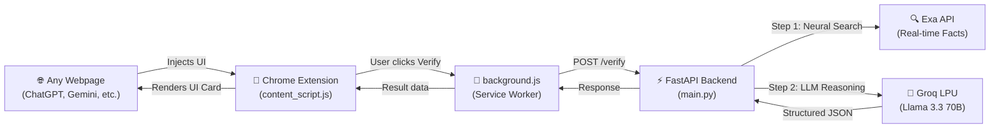
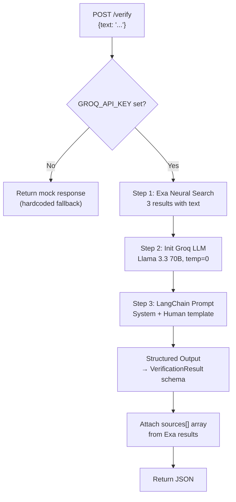

# 🛡️ Truth Guard 

## What Is Truth Guard?

Truth Guard is a **real-time AI hallucination detection and correction system**. It's a Chrome extension that adds a "Verify Truth" button next to any AI-generated response (ChatGPT, Gemini, etc.), and when clicked, sends that text to a Python backend that checks it against real internet sources and flags anything that's wrong.

---

## Architecture Overview



The system has **3 layers**:

| Layer | Technology | Purpose |
|-------|-----------|---------|
| **Frontend** | Chrome Extension (Manifest V3) | Injects verify buttons, renders result cards |
| **Middleware** | Extension Service Worker | Routes messages between content script ↔ backend |
| **Backend** | Python FastAPI + LangChain | Fact-checks text using Exa search + Groq LLM |

---

## Project File Structure

```
truth-guard/
├── extension/                    # Chrome Extension (Frontend)
│   ├── manifest.json             # Extension config (Manifest V3)
│   ├── background.js             # Service worker — routes API calls
│   ├── content_script.js         # Injected into pages — all the UI logic
│   └── styles.css                # Premium visual styles
├── backend/                      # Python Backend
│   ├── main.py                   # FastAPI server with /verify endpoint
│   ├── evaluate_halueval.py      # Benchmarking script (HaluEval dataset)
│   ├── requirements.txt          # Python dependencies
│   ├── .env                      # API keys (GROQ + EXA)
│   ├── halueval_sample.json      # Local HaluEval dataset (3.5MB)
│   └── evaluation_results.csv    # Saved benchmark results
├── test_env/                     # Local testing
├── README.md                     # Project documentation
```

---

## Deep Dive: Each File Explained

---

### 1. `extension/manifest.json` — Extension Identity

This is the Chrome extension's config file. Key points:

- **Manifest V3** — the latest Chrome extension standard
- **Permissions**: `activeTab`, `scripting` — can interact with the current page
- **Host permissions**: `http://localhost:8000/*` — allowed to call your local backend
- **Content scripts**: Injects `styles.css` + `content_script.js` into **every page** (`<all_urls>`)

> [!NOTE]
> Because it matches `<all_urls>`, the extension will try to add verify buttons on *any* website — but the CSS selectors in `content_script.js` only target specific AI chat message patterns.

---

### 2. `extension/background.js` — The Message Router

This is a **service worker** (runs in the background, not on any page). Its only job:

1. Listens for `verify_text` messages from `content_script.js`
2. Makes a `POST` request to `http://localhost:8000/verify` with the text
3. Sends the JSON response back to the content script

```
Content Script → "verify_text" message → Background.js → fetch() → Backend
                                                            ↓
Content Script ← response ← Background.js ← JSON ← Backend
```

> [!IMPORTANT]
> The `return true;` at the end is critical — it tells Chrome "I'll respond asynchronously" so the message channel stays open while `fetch()` completes.

---

### 3. `extension/content_script.js` — The Brain of the Extension

This is where all the magic happens on the frontend. It has **5 key functions**:

#### `addVerifyButtons()`
- Scans the DOM for AI message elements using CSS selectors:
  - `.ai-message` — generic
  - `[data-message-author-role="assistant"]` — ChatGPT
  - `message-content` — Gemini
- Adds a **🛡️ Verify Truth** button to each one
- Prevents duplicates via nesting checks

#### Button Click Handler (inside `addVerifyButtons`)
When clicked:
1. Disables the button and shows animated processing states cycling every 800ms:
   - ⚙️ Extracting Claims...
   - 🔍 Querying Exa Search...
   - 🧠 Verifying via Groq LPU...
2. Clones the message DOM, strips buttons, extracts inner text
3. Starts a `performance.now()` timer for latency tracking
4. Sends the text via `chrome.runtime.sendMessage` to `background.js`
5. On response, either:
   - **Hallucination found** → calls `highlightHallucination()` with red button
   - **Verified safe** → calls `showVerifiedSafeCard()` with green button

#### `buildSourcesHTML(sources)`
- Takes an array of `{url, title}` objects from the backend
- Renders up to 3 clickable source links with numbered badges and external-link icons

#### `showVerifiedSafeCard(messageElement, score, sources)`
- Appends a green-bordered card showing:
  - ✅ "Verified Safe" header with confidence badge
  - Animated confidence progress bar
  - Source verification links
- Auto-dismisses after 8 seconds

#### `highlightHallucination(messageElement, ...)`
- Appends a red-bordered analysis card showing:
  - ⚠️ "Hallucination Detected" header
  - **Original Claim** (struck-through in red)
  - **Correction** (highlighted in green)
  - **Confidence bar** (animated teal gradient)
  - **Risk level bar** (Low/Moderate/High with yellow/orange/red color)
  - **Source verification links** (up to 3 clickable sources)
  - **Apply Correction** button — replaces the false text inline

#### MutationObserver
- Watches the DOM for new elements being added (like when ChatGPT streams a new message)
- Re-runs `addVerifyButtons()` to catch new messages

---

### 4. `extension/styles.css` — Premium Visual Design

~305 lines of CSS covering:

| Component | Design |
|-----------|--------|
| **Verify Button** | Purple-blue gradient, hover lift effect, pulse-glow animation when processing |
| **Analysis Card** | Glassmorphism (backdrop-blur), red/green left border, slide-up entrance animation |
| **Progress Bars** | 8px rounded bars with smooth 0.8s fill animation |
| **Risk Colors** | Yellow (Low), Orange (Moderate), Red (High) gradients |
| **Source Links** | Pill-shaped with numbered gradient badges, hover slide `translateX(4px)` |
| **Apply Button** | Full-width red button with shadow, hover darken + lift |

---

### 5. `backend/main.py` — The FastAPI Verification Engine

This is the core intelligence. A single endpoint: `POST /verify`

#### Flow:



#### Key Design Decisions:

1. **Pydantic Schema** (`VerificationResult`) — Forces the LLM to output structured JSON with exact fields: `status`, `confidence_score`, `original_text`, `correction`, `source`

2. **RAG Pattern** — The LLM doesn't just guess. It gets real internet context from Exa, then reasons against it. The system prompt says: *"If the user's text contradicts the Internet Context, set status to false"*

3. **Fallback Logic** — If no API key is set, it returns hardcoded mock responses (e.g. catches "Berlin" → Eiffel Tower correction). Great for local testing without API keys.

4. **Sources Array** — After the LLM responds, it attaches the actual Exa search result URLs + titles as a `sources[]` array for the frontend to display.

---

### 6. `backend/evaluate_halueval.py` — Benchmarking Pipeline

This script measures how well Truth Guard actually works using the **HaluEval** dataset (a standard hallucination evaluation benchmark).

#### How it works:

1. **Loads data** from either:
   - HuggingFace `datasets` library (`uhg-research/HaluEval` QA split)
   - Local `halueval_sample.json` file (~3.5MB, thousands of samples)
   - Hardcoded test cases (last resort fallback)

2. **Runs verification concurrently** using `asyncio.Semaphore(15)` — up to 15 API calls at once, preventing rate limit issues

3. **Calculates metrics** using scikit-learn:
   - **Accuracy** — Overall correctness
   - **Precision** — Of things flagged as hallucinations, how many actually were
   - **Recall** — Of actual hallucinations, how many were caught
   - **F1-Score** — Harmonic mean of precision and recall

4. **Saves results** to `evaluation_results.csv` for further analysis

> [!TIP]
> The script limits to 150 samples by default to prevent burning through Groq/Exa API quotas. Adjust line 74 to change this.

---

### 7. `backend/.env` — API Keys

Contains two keys:
- `GROQ_API_KEY` — For Groq's LPU inference (runs Llama 3.3 70B)
- `EXA_API_KEY` — For Exa's neural search API (fetches real-time web facts)

---

## End-to-End Data Flow

Here's exactly what happens when a user clicks **🛡️ Verify Truth**:

```
1. User clicks button on ChatGPT page
    ↓
2. content_script.js extracts the AI response text
    ↓
3. Sends {action: "verify_text", text: "..."} to background.js
    ↓
4. background.js POSTs to http://localhost:8000/verify
    ↓
5. FastAPI receives the text
    ↓
6. Exa neural search finds 3 relevant web pages
   → Returns URLs, titles, and page text snippets
    ↓
7. LangChain builds a prompt with:
   - System: "You are a fact-checking AI..."
   - Human: "Internet Context: [Exa results]\n\nUser Text: [input]"
    ↓
8. Groq runs Llama 3.3 70B with structured output
   → Returns: {status, confidence_score, original_text, correction, source}
    ↓
9. Backend attaches Exa sources[] to the response
    ↓
10. JSON response flows back: Backend → background.js → content_script.js
    ↓
11. Frontend renders either:
    - ✅ Green "Verified Safe" card (with confidence bar + sources)
    - ⚠️ Red "Hallucination Detected" card (with original, correction,
         confidence bar, risk bar, sources, and "Apply Correction" button)
```

---

## Tech Stack Summary

| Component | Technology |
|-----------|-----------|
| Extension | Chrome Manifest V3, Vanilla JS, CSS3 |
| Backend Framework | FastAPI (Python) |
| LLM | Llama 3.3 70B via Groq LPU |
| Search/RAG | Exa Neural Search API |
| Orchestration | LangChain (prompts + structured output) |
| Evaluation | HaluEval dataset, scikit-learn metrics |
| Concurrency | Python asyncio with semaphore |
